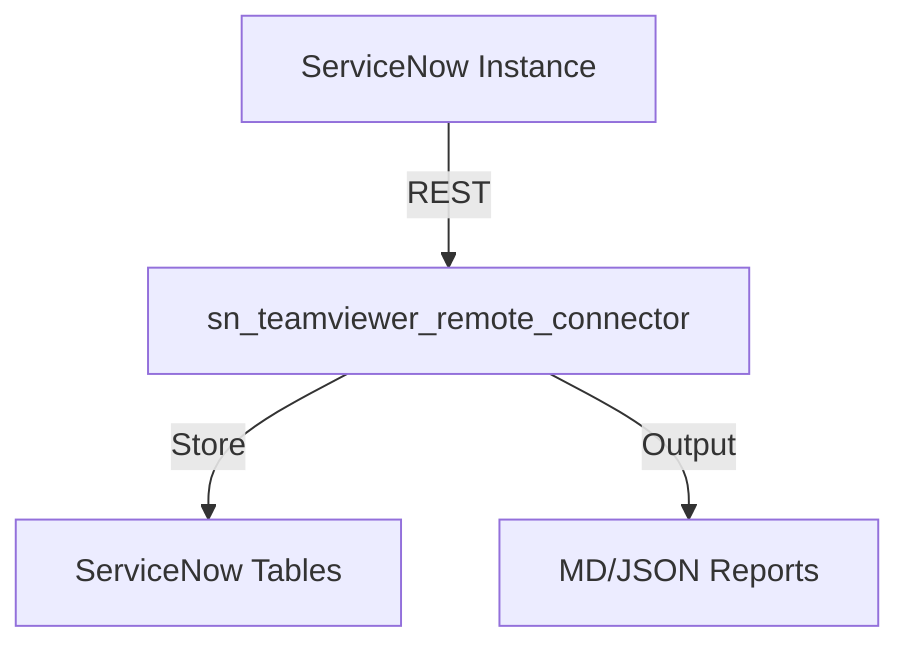

# sn_teamviewer_remote_connector
Author: Vladimir Kapustin

## Architecture

## Installation
```bash
git clone https://github.com/vladarchitectservicenow-oss/sn_teamviewer_remote_connector.git
cd sn_teamviewer_remote_connector
python3 src/cli.py --sn-url https://dev.instance.com --help
```
## ROI Calculator
| Metric | Manual | With sn_teamviewer_remote_connector |
|--------|--------|-------------|
| Setup time/yr | 40h | 5h |
| Cost @ $85/hr | $3,400 | $425 |
| **Savings** | — | **$2,975 (87%)** |
## API Reference
```bash
# Get incidents
GET /api/now/table/incident?sysparm_limit=10
# Run scan
POST /api/x_sn_teamviewer_remote_connector/scan
```
## Security & Compliance
- HTTPS-only API calls
- Credentials via environment variables
- GDPR: no PII stored in reports
- Audit: all operations logged to `sys_log`
## Troubleshooting
| Symptom | Fix |
|---------|-----|
| Connection timeout | Increase `--timeout 60` |
| 401 Unauthorized | Verify `--sn-user` and `--sn-pass` |
| Empty report output | Check filter scope and date range |
| Missing module | `pip install requests` |
## Testing
Run: `pytest tests/ -v`
Expected: 7/7 PASS minimum
## License
Copyright (C) 2026 Vladimir Kapustin
Licensed under GNU Affero General Public License v3.0
See LICENSE file for full terms.

